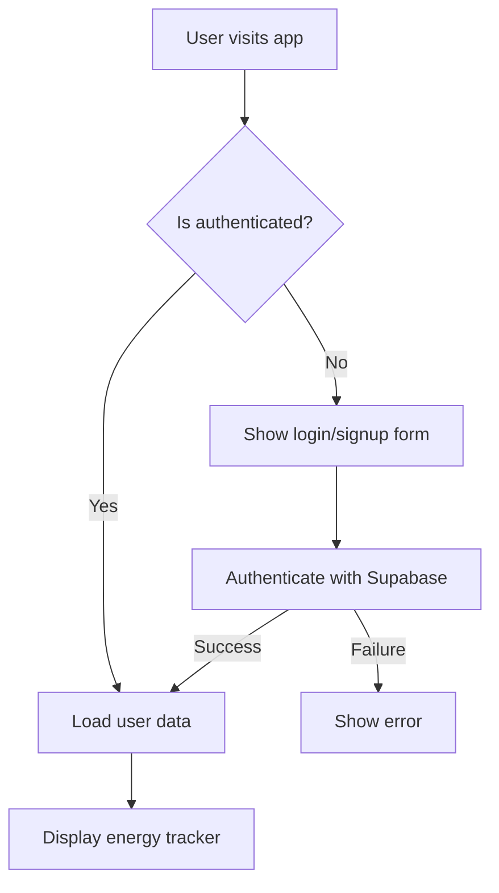

# Supabase Integration Architecture Plan

## Overview
Replace localStorage with Supabase for persistent, multi-user energy tracking. Implement user authentication to ensure data privacy and enable cross-device access.

## Current State Analysis
- **Storage**: localStorage with JSON serialization
- **Data Types**: EnergyReading, MonthlySummary, YearlySummary
- **Components**: EnergyInputForm, EnergyOverview
- **State Management**: React useState with localStorage persistence

## Database Schema Design

### Tables

#### users
- `id`: uuid (primary key, references auth.users)
- `email`: text (unique)
- `created_at`: timestamp
- `updated_at`: timestamp

#### energy_readings
- `id`: uuid (primary key)
- `user_id`: uuid (foreign key to users.id)
- `date`: date
- `electricity_day`: decimal(10,2)
- `electricity_night`: decimal(10,2)
- `gas`: decimal(10,2)
- `created_at`: timestamp
- `updated_at`: timestamp

### Indexes
- energy_readings: (user_id, date) composite index

### Row Level Security (RLS)
- Enable RLS on all tables
- Policies: users can only access their own data

## Authentication Architecture

### Supabase Auth Integration
- Email/password authentication
- Automatic user profile creation on signup
- Session management with Supabase client
- Protected routes for authenticated users only

### Auth Flow

## API Integration Points

### Supabase Client Setup
- Initialize client with environment variables
- Configure auth and database connections

### Data Access Layer
- Create custom hooks for CRUD operations
- Error handling and loading states
- Real-time subscriptions for collaborative features (future)

### Key API Functions
- `getEnergyReadings(userId)`: Fetch user's readings
- `createEnergyReading(reading)`: Add new reading
- `updateEnergyReading(id, reading)`: Update existing reading
- `deleteEnergyReading(id)`: Remove reading

## Data Migration Strategy

Since this is a new application that has not been deployed, there is no existing localStorage data to migrate. Users will start fresh with Supabase as the data store.

## Component Architecture Updates

### State Management Changes
- Replace localStorage with Supabase queries
- Add auth state management
- Implement loading and error states

### Component Modifications
- EnergyInputForm: Add user context, update API calls
- EnergyOverview: Fetch data from Supabase
- Add Auth components: Login, Signup, Logout

## Security Considerations

### Data Privacy
- RLS ensures users only access their own data
- Encrypt sensitive data if needed (not required for meter readings)

### Authentication Security
- Secure password policies
- Session timeout handling
- CSRF protection via Supabase

## Deployment Considerations

### Environment Variables
- `NEXT_PUBLIC_SUPABASE_URL`
- `NEXT_PUBLIC_SUPABASE_ANON_KEY`

### Database Setup
- Run schema migrations on deployment
- Seed initial data if needed

## Error Handling and UX

### Offline Support
- Cache data locally for offline viewing
- Sync when connection restored

### Error Scenarios
- Network failures: Show retry options
- Auth failures: Redirect to login
- Data conflicts: Show merge options

## Data Model Changes

### Start Numbers
Instead of a separate start_numbers table, the application will use the earliest energy reading as the baseline for calculations. This simplifies the data model and reduces complexity.

### Calculation Logic
- Sort readings by date ascending
- Use the first reading as start numbers for delta calculations
- Monthly/yearly summaries calculated as differences from the previous reading

## Future Extensibility

### Potential Enhancements
- Real-time data sharing between devices
- Data export/import features
- Advanced analytics and reporting
- Multi-user household accounts

This architecture provides a solid foundation for scaling the energy tracker from a local app to a cloud-based, multi-user service.